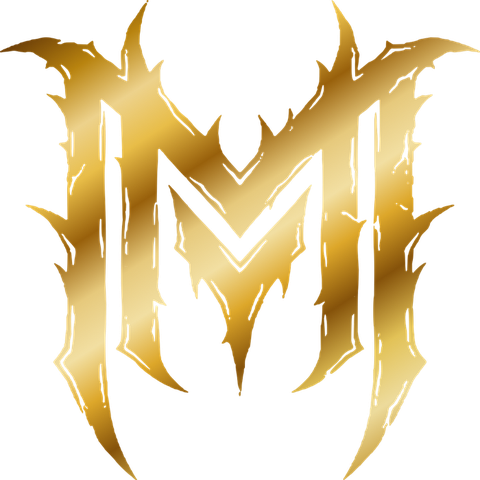
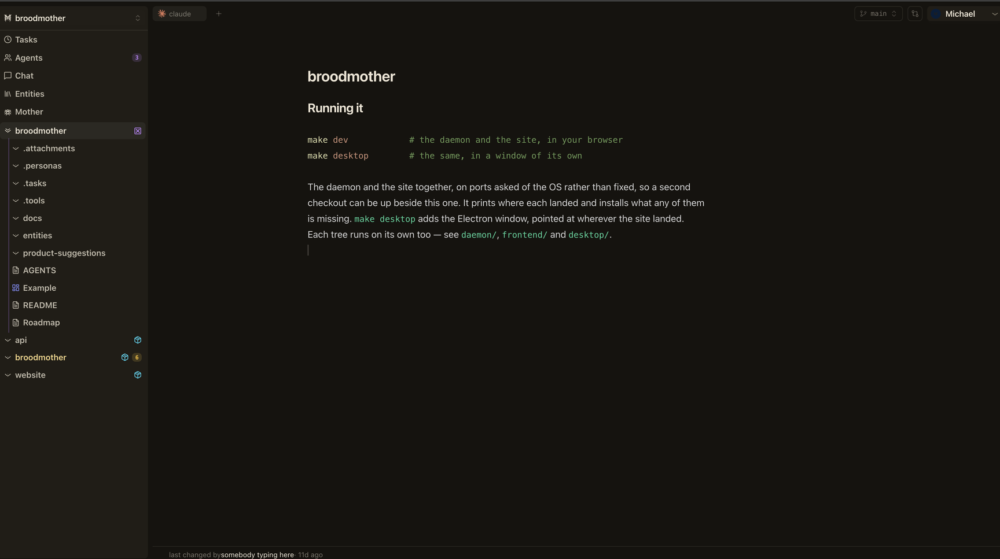
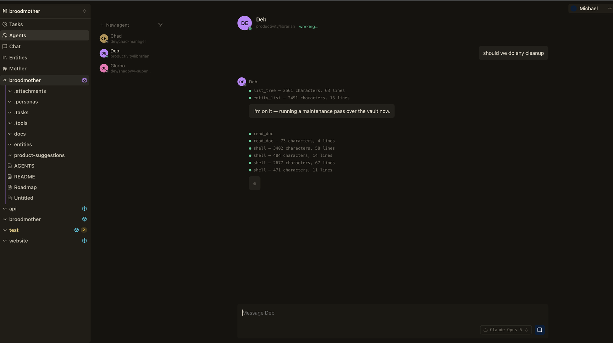
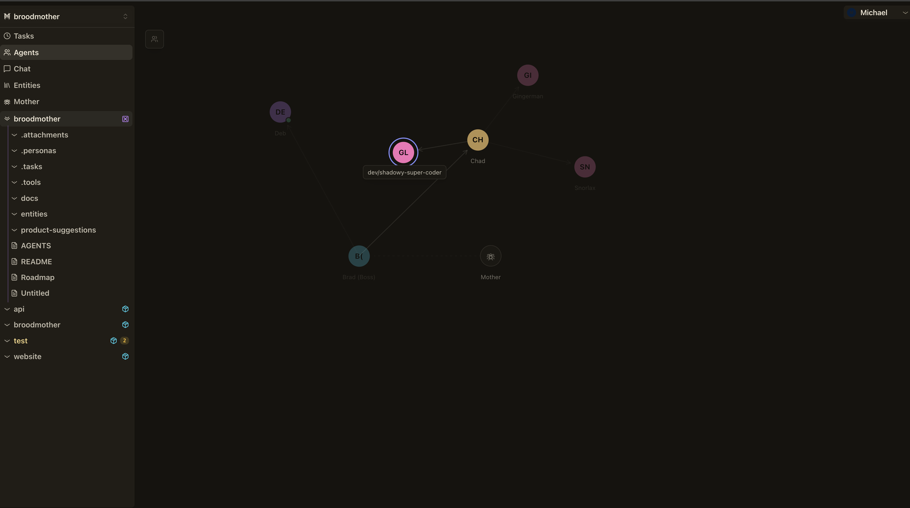
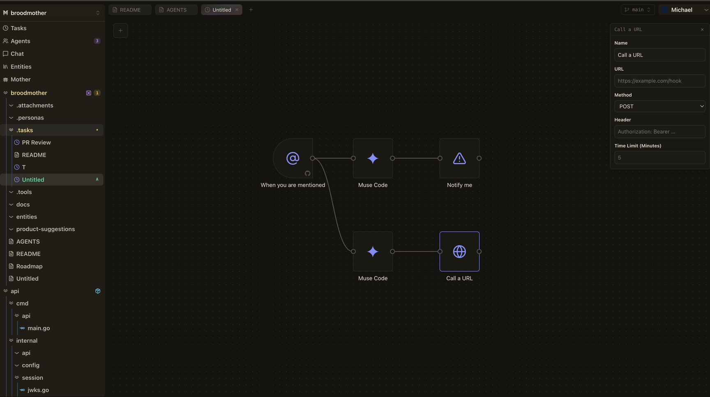
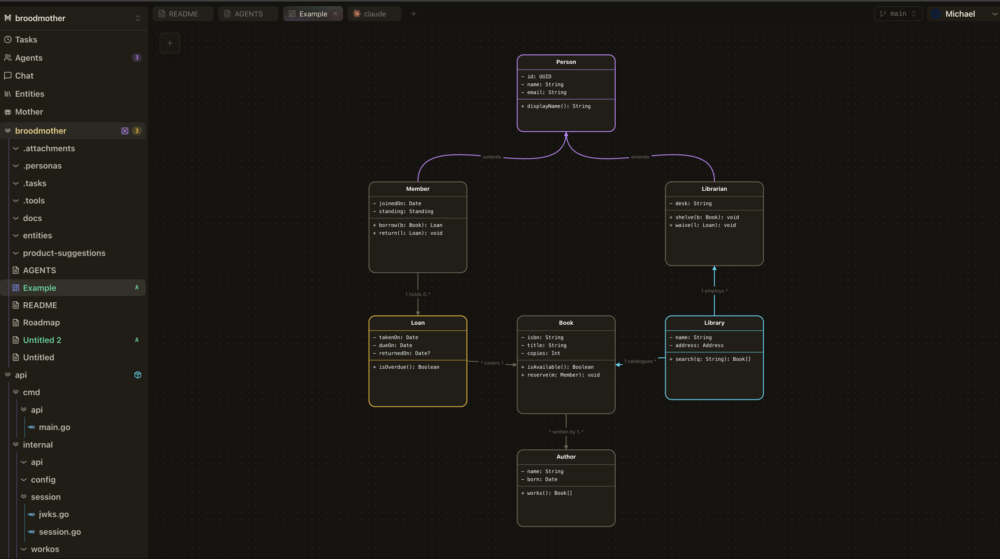
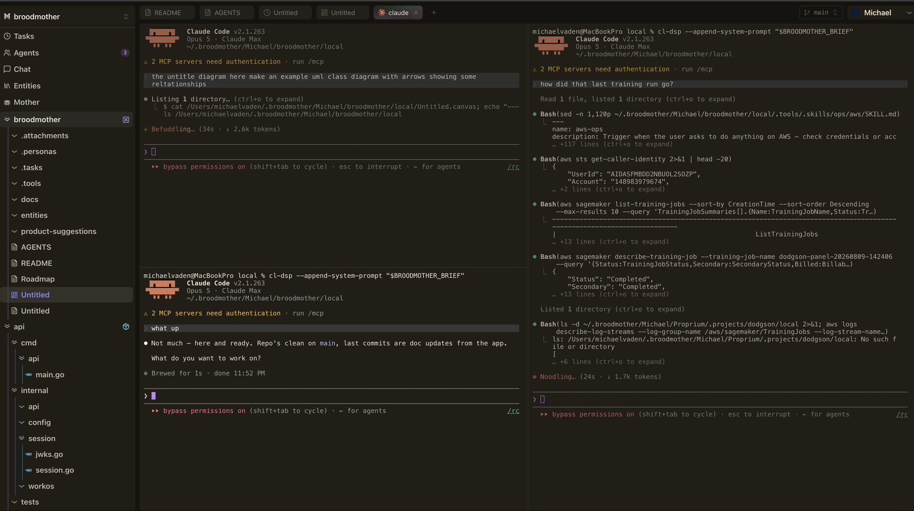

<p align="center">
  
</p>

<p align="center">
  <a href="LICENSE.md"></a>
</p>

# broodmother

An app for a folder of markdown and the repositories that folder is about. The `.md` files on disk are the source of truth and git is the history — there is no database behind the documents, and nothing here is written anywhere you could not open with an editor. What the app adds is what a folder cannot do for itself: agents that work in it, tasks that run on their own, boards it draws instead of typing, records it refuses to write carelessly, and shells with the checkout already open.

## Documents



The sidebar is one project. The rows under its name are its notes; the rows under those — `api`, `broodmother`, `website` — are code repositories checked out inside it, as many as the notes cover, all of them open at once, each on whichever branch you left it on. The editor follows the file on disk, so a document changed behind the app's back — by a shell, by a pull, by an agent — reaches the page without anybody asking.

The line at the foot is the ledger. Every write files an act, so a document can say who last changed it and when, in a sentence rather than a row.

## Agents



An agent is people-shaped. It has a name, a persona out of the project's `.personas/` folder, one conversation held with it for as long as it exists, and an attachments folder made at the same moment so it is in the tree from the first message. A reply arrives a word at a time, and every tool call it makes is listed as it lands — what was read, what the shell said, how many lines came back — so what an agent did is on the page rather than in a log somewhere. A socket closing does not stop a reply being written: a lid, a sleep and a reload all look alike from here, and none of them is somebody saying they were done.

## Who escalates to whom



The chart is a forest with one lead each, because the question a chart is asked is who to escalate to. A line that would close on itself is refused — the app walks upward from the proposed lead and stops if it meets the agent on the way.

## Tasks



A task is a flow the daemon runs: triggers on the left, the steps they set off after them. A trigger is a person pressing play, an interval, a time of day, a file changing, or GitHub — an issue opened, a pull pushed to, a mention, a branch's checks settling. A step is an agent errand, a shell command, a call out to a URL, a notification, or a comment or pull request written back to GitHub.

The file is the only channel between steps: what one writes is what the next is handed, and the run's folder keeps every one of those hand-offs afterwards as its record. A layer runs four at a time, since its members cannot feed each other. A step may end its own branch, halt the flow, or stop and wait for a person — a run that stops at a question keeps its place, and answering it sends the walk back in from there. Schedules are mirrored into the system crontab, because the app might not be running when the clock strikes and cron will be.

## Diagrams



A `.canvas` is [JSON Canvas](https://jsoncanvas.org), the format Obsidian writes, so a diagram made here opens there. Shapes, fills, edges that know which side they leave from and what they are labelled, and class boxes whose compartments are the name, the fields and the methods.

Both boards are documents the whole way down. The browser parses one to draw it and the daemon parses the same bytes before it writes them, and the two are held to the same corpus of recorded answers — because a document one accepts and the other refuses is a document that opens and cannot be saved.

## Shells



Terminals are ptys the daemon opened, named by the tab watching them, and they outlive their socket the way a shell should outlive a shut lid. They open on the checkout you are looking at, split across the pane, and the app can tell a shell sitting at a prompt from one that is busy — including a Claude Code session waiting to be told what next, which no process list can distinguish from one that is thinking.

## And underneath

Records, which are ordinary markdown with a header the app owns: a person, a decision, a finding, a question. Every one says where it came from, sources have to resolve to documents that exist and cannot close a loop, and writing the same thing twice answers with the record that already says it rather than forking the graph. Moving a document rewrites every wikilink pointing at it. Every write files an act, so a document can say who did what to it and when. And the project commits, pulls and pushes itself once it goes quiet.

## Running it

```sh
make dev            # the daemon and the site, in your browser
make desktop        # the same, in a window of its own
```

The daemon and the site together, on ports asked of the OS rather than fixed, so a second
checkout can be up beside this one. It prints where each landed and installs what any of them
is missing. `make desktop` adds the Electron window, pointed at wherever the site landed.
Each tree runs on its own too — see `daemon/`, `frontend/` and `desktop/`.
